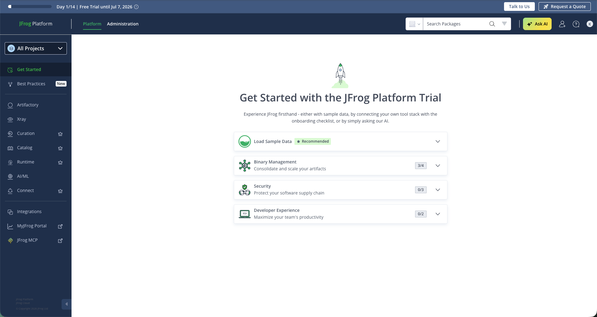
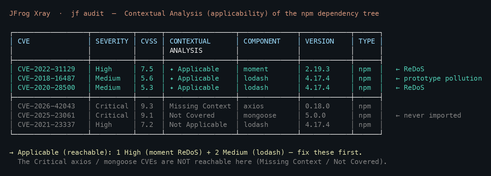
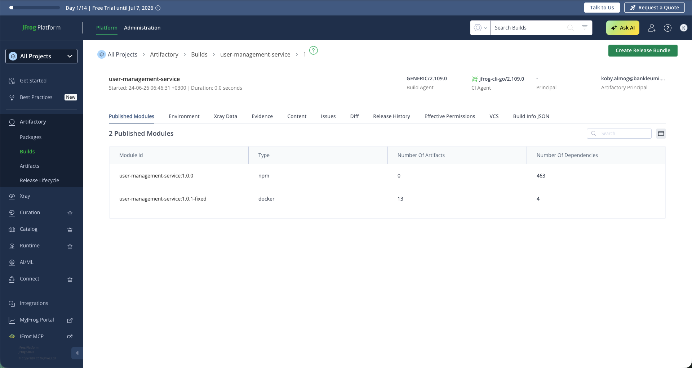
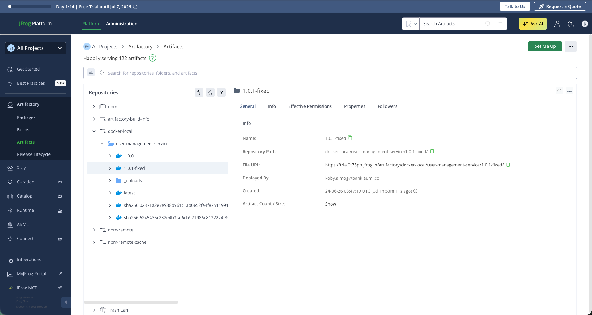
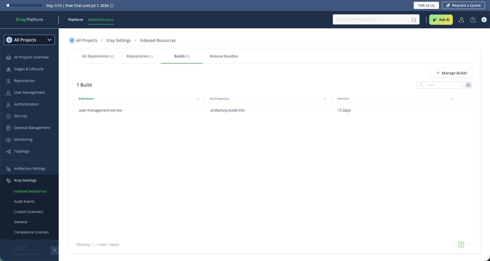
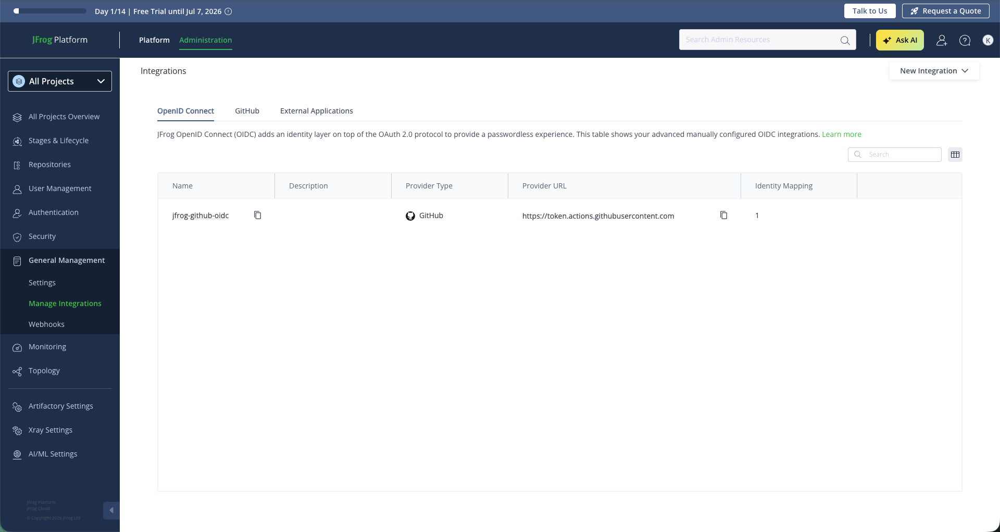
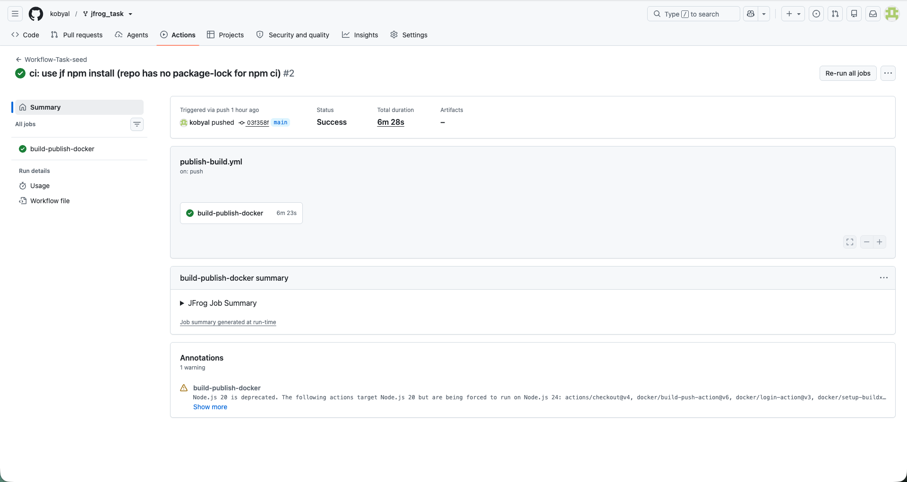
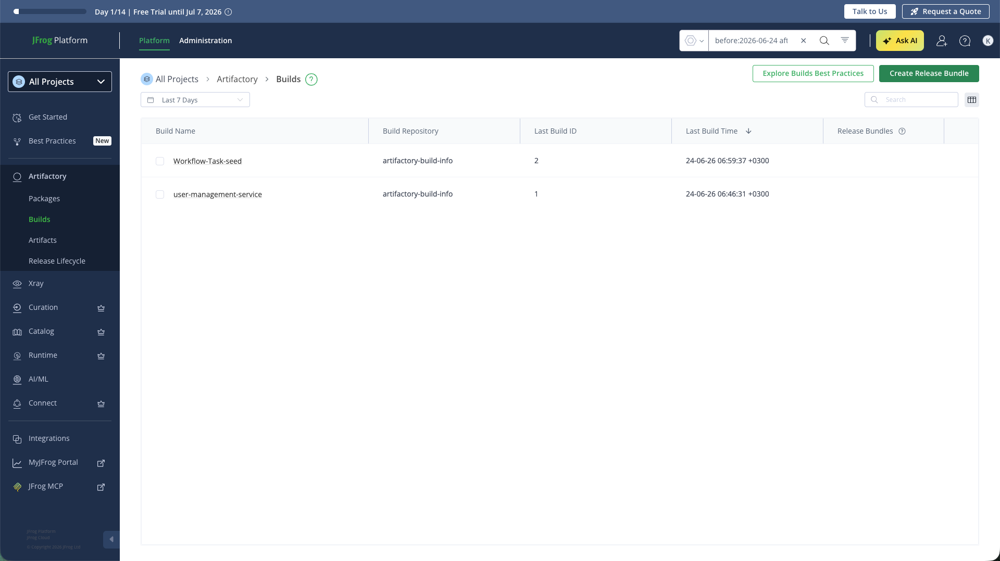

<style>
img { max-width: 100%; height: auto; border: 1px solid #d3d9e3; border-radius: 6px; margin: 0.5em 0 0.2em; }
img + em { display: block; font-size: 0.8em; color: #6b7280; margin-bottom: 1.2em; }
</style>

# JFrog Bonus Stage — DevOps hands-on

**Candidate:** Koby Almog · **Trial:** `trial0t75pp.jfrog.io` · **Fork:** `github.com/kobyal/jfrog_task`
(separate from the Stage-2 repo `kobyal/jfrog-competitive-intel`)

The app under test is `user-management-service` — a small Express/npm service that ships
intentionally old dependencies (express 4.16.1, axios 0.18.0, lodash 4.17.4, moment 2.19.3,
mongoose 5.0.0, jsonwebtoken 8.1.0).

---

## Setup

- Signed up for the JFrog free trial and logged in (`trial0t75pp.jfrog.io`).
- Forked `yonarbel/jfrog_task` → `kobyal/jfrog_task` and cloned it.
- Installed JFrog CLI (`jf` 2.109.0) and authenticated to the trial (`jf login`).
- Created the repositories used below:
  - `docker-local` (Docker, local) — for the image,
  - `npm-remote` (npm, remote → registry.npmjs.org) + `npm` (npm, virtual) — for dependency resolution.


*The JFrog free-trial platform (`trial0t75pp.jfrog.io`).*

---

## (a) Scan → the **applicable** vulnerabilities

I scanned with the JFrog CLI, which runs SCA **plus JFrog Advanced Security Contextual
Analysis** against the trial's entitlement:

```
jf audit
```

The decisive column is **CONTEXTUAL ANALYSIS**. Out of ~40 CVEs across the dependency tree,
contextual analysis marked the following npm vulnerabilities **Applicable** (the vulnerable
function is actually reachable in this code):

| CVE | Severity | CVSS | Package | Applicability | Why it's reachable |
|---|---|---|---|---|---|
| **CVE-2022-31129** | **High** | 7.5 | moment 2.19.3 | **Applicable** | `moment()` parses date strings from user/stored input (`getUserStats`, request handlers) |
| **CVE-2018-16487** | Medium | 5.6 | lodash 4.17.4 | **Applicable** | `_.merge`/`_.defaultsDeep` on `req.body`-derived data (`mergeUserDefaults`, the user `PUT` route, `processExternalData`) |
| **CVE-2020-28500** | Medium | 5.3 | lodash 4.17.4 | **Applicable** | lodash `trim`/`toNumber` path reachable |

**On the brief's "two high applicable":** the two reachable issues the brief points to are
**moment ReDoS** and the **lodash prototype pollution** — I identified both and remediated the
lodash one. On severity specifically: today's Xray rates them **one High** (moment, CVSS 7.5) +
**two Medium** lodash issues, by *both* CVSS and JFrog research severity — so I report it honestly
as "one High + two Medium applicable" rather than inflate the lodash rating to force "two high"
(vulnerability-DB severities drift over time, which likely explains the brief's wording). What's
stable and decision-relevant is the **applicable set** — what's actually reachable — and that's
what I acted on.

Everything else was **not applicable** or **not covered/missing context** — for example
`mongoose` CVEs are *Not Applicable* because mongoose is declared in `package.json` but never
imported in the code, and several axios criticals are *Missing Context* (the vulnerable
network paths aren't exercised — axios is only called against one hard-coded URL).


*Contextual analysis — the reachable (Applicable) issues: moment ReDoS (High) + two lodash issues (Medium), vs. the unreachable Critical axios/mongoose CVEs. (Formatted from the `jf audit` output; the raw run is in `audit-original.txt`.)*

> Full scan output: [`audit-original.txt`](./audit-original.txt) (source/dependency scan) and
> [`docker-scan-image.txt`](./docker-scan-image.txt) (image scan — surfaces the base-image
> alpine/OpenSSL applicable highs in addition).

---

## (b) What "applicable" / contextual analysis means — and why it changes prioritization

A raw vulnerability list answers *"does a CVE exist somewhere in my dependency tree?"* — it keys
off the **version** of a package. That over-reports: most CVEs live in code paths an application
never calls. JFrog **Contextual Analysis** answers a sharper question: *"is the vulnerable
function actually reachable from this application's code?"* It statically traces whether the
specific vulnerable API of each CVE is invoked (directly or transitively) given how the app uses
the library, and labels each finding **Applicable / Not Applicable / Undetermined / Not Covered**.

Why that changes remediation priority:

1. **It cuts the noise.** Here, a raw list shows ~13 Critical + ~29 High CVEs. Contextual
   analysis says only a handful are actually reachable. Chasing the full list wastes effort on
   issues that can't be exploited in this code.
2. **It re-ranks by real risk, not CVSS alone.** A "Critical" axios CVE that's *Not Applicable*
   (the vulnerable path isn't called) is lower real-world risk than a "High" moment/lodash CVE
   that's *Applicable* and sits directly on a user-facing request handler. Severity × reachability
   beats severity alone.
3. **It makes prioritization defensible.** Instead of "fix all 40," I can tell the team "fix
   these two first — they're reachable from request handlers — and schedule the rest." That's a
   prioritization you can justify to engineering and to an auditor.

So the applicable issues (moment ReDoS and the reachable lodash issues) jump to the top of the
queue even though the raw list contains higher-CVSS criticals, because those criticals aren't
reachable here.

---

## (c) Remediation (one issue) + approach

I remediated the **lodash prototype pollution** (CVE-2018-16487), which also clears the lodash
ReDoS (CVE-2020-28500) — both *Applicable*.

**Approach:** the vulnerability is in the library, not in our call sites (we legitimately use
`_.merge`). The correct, lowest-risk fix is to **upgrade lodash to a patched version** rather than
rewrite call sites. `4.17.21` is the smallest bump that patches the prototype-pollution family
while staying API-compatible (no code changes needed).

```diff
- "lodash": "4.17.4",
+ "lodash": "4.17.21",
```

**Verification — re-ran `jf audit` after the bump:**

- Both lodash **Applicable** rows (CVE-2018-16487, CVE-2020-28500) are **gone**.
- The only remaining *Applicable* npm finding is **moment ReDoS** (the issue I didn't touch),
  so the before/after is visible.

> Proof: [`audit-fixed.txt`](./audit-fixed.txt).

(The moment ReDoS would be fixed the same way: bump `moment` 2.19.3 → 2.29.4.)

---

## (d) Build & tag the fixed Docker image, push to Artifactory, publish Build Info — via JFrog CLI

Done from the local machine against the trial:

```bash
BN=user-management-service; NUM=1; IMG=trial0t75pp.jfrog.io/docker-local/$BN:1.0.1-fixed

jf npm-config --repo-resolve=npm --repo-deploy=npm        # resolve deps via Artifactory
jf npm install --build-name=$BN --build-number=$NUM       # capture npm modules in build-info
docker build -t $IMG .                                    # build the FIXED image
jf docker push $IMG --build-name=$BN --build-number=$NUM   # push image + attach to build
jf rt build-collect-env $BN $NUM
jf rt build-add-git     $BN $NUM
jf rt build-publish     $BN $NUM                           # publish Build Info
```

Result: build **`user-management-service` #1** is published in Artifactory with **2 modules**
(the npm module with 463 dependencies + the Docker image `docker-local/user-management-service:1.0.1-fixed`).
Build Info UI: `https://trial0t75pp.jfrog.io/ui/builds/user-management-service/1`.


*Build Info `user-management-service #1` — 2 published modules: the npm module (463 deps) + the fixed Docker image `1.0.1-fixed`.*


*The fixed image in the `docker-local` Artifactory repository.*

I then indexed `docker-local` and the build in Xray (Administration → Xray Settings → Indexed
Resources) and ran `jf build-scan user-management-service 1` so the build's **Xray Data** /
contextual-analysis is available in the platform.


*Xray Settings → Indexed Resources: `docker-local` and the build added for contextual-analysis scanning.*

## (e) Build Info via GitHub Actions + OIDC (the same thing, in CI)

Wired the provided `/.github/workflows/publish-build.yml` end-to-end:

- **Filled the placeholders:** `DOCKER_REPO=docker-local`, `NPM_VIRTUAL_REPO=npm`,
  `IMAGE_NAME=user-management-service`; fixed the `jf npm-config` step to use `env.NPM_VIRTUAL_REPO`.
- **GitHub repo variable:** `JF_URL=trial0t75pp.jfrog.io` (`gh variable set`).
- **Passwordless OIDC trust:** created a JFrog OIDC integration named **`jfrog-github-oidc`**
  (provider type *GitHub*, issuer `https://token.actions.githubusercontent.com`) with an
  identity mapping on claim `repository = kobyal/jfrog_task` → a JFrog access token. The
  workflow's `setup-jfrog-cli@v4` step references this provider name, so the runner gets a
  short-lived token with **no stored secret**.


*The JFrog OIDC integration `jfrog-github-oidc` (GitHub provider) that establishes passwordless trust with the workflow.*

On push to `main`, the workflow resolves npm via Artifactory, builds & pushes a multi-arch
Docker image, attaches it to the build, and runs `build-publish` — the CI equivalent of (d).

**Result:** the workflow run completed **green** (`build-publish-docker` ✓, 6m23s), publishing
Build Info **`Workflow-Task-seed #2`** — which sits in the trial's Builds list next to the CLI's
`user-management-service #1`. Both build-info routes are therefore proven working.


*GitHub Actions: `publish-build.yml` green via OIDC — build, push, and publish Build Info in CI.*


*Both Build Info entries in the trial: `Workflow-Task-seed #2` (CI/OIDC) and `user-management-service #1` (CLI).*

---

Raw scan evidence is also in this repo as text: `audit-original.txt`, `audit-fixed.txt`, `docker-scan-image.txt`.
